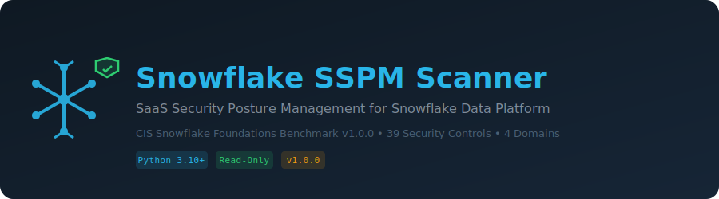

<p align="center">
  
</p>

# Snowflake SSPM Scanner

**SaaS Security Posture Management scanner for Snowflake Data Platform**

A read-only, single-file Python scanner that audits your Snowflake account against the **CIS Snowflake Foundations Benchmark v1.0.0** (October 2023). Connects via the Snowflake Python Connector, runs SQL-based audit queries, and produces console, JSON, and HTML reports with compliance mappings.

---

## Features

- **39 security checks** across 4 CIS domains
- **Compliance mapping** per finding: CIS Snowflake v1.0.0, NIST 800-53 Rev 5, ISO 27001:2022, SOC 2
- **Three output formats**: ANSI console, JSON, self-contained HTML dashboard
- **Severity-weighted scoring** with letter grade (A-F)
- **Read-only** — no modifications to your Snowflake account
- **Single-file deployment** — one Python file, one dependency
- **Multiple auth methods**: password, key pair, SSO (externalbrowser)
- **Exit code 1** on critical failures or below `--min-score` threshold

---

## Security Domains & Checks

| Domain | CIS Section | Checks | Rule ID Prefix |
|--------|-------------|--------|----------------|
| **Identity & Access Management** | 1.1 - 1.17 | 17 | `SF-IAM-*` |
| **Monitoring & Alerting** | 2.1 - 2.9 | 9 | `SF-MON-*` |
| **Networking** | 3.1 - 3.2 | 2 | `SF-NET-*` |
| **Data Protection** | 4.1 - 4.11 | 11 | `SF-DP-*` |

### Check Details

| Rule ID | CIS Ref | Title | Severity | Profile |
|---------|---------|-------|----------|---------|
| SF-IAM-001 | 1.1 | SSO is configured for your account | HIGH | L1 |
| SF-IAM-002 | 1.2 | SCIM integration is configured | MEDIUM | L2 |
| SF-IAM-003 | 1.3 | Snowflake password is unset for SSO users | MEDIUM | L1 |
| SF-IAM-004 | 1.4 | MFA enabled for password-authenticated users | CRITICAL | L1 |
| SF-IAM-005 | 1.5 | Password policy enforces 14+ character minimum | HIGH | L1 |
| SF-IAM-006 | 1.6 | Service accounts use key pair authentication | HIGH | L1 |
| SF-IAM-007 | 1.7 | Authentication key pairs rotated every 180 days | MEDIUM | L1 |
| SF-IAM-008 | 1.8 | Inactive users (90+ days) are disabled | MEDIUM | L1 |
| SF-IAM-009 | 1.9 | Idle session timeout <= 15 min for admin roles | HIGH | L1 |
| SF-IAM-010 | 1.10 | ACCOUNTADMIN/SECURITYADMIN user count is limited | HIGH | L1 |
| SF-IAM-011 | 1.11 | ACCOUNTADMIN users have email addresses | MEDIUM | L1 |
| SF-IAM-012 | 1.12 | No admin roles set as default role | HIGH | L1 |
| SF-IAM-013 | 1.13 | Admin roles not granted to custom roles | HIGH | L1 |
| SF-IAM-014 | 1.14 | Tasks not owned by admin roles | MEDIUM | L1 |
| SF-IAM-015 | 1.15 | Tasks don't run with admin privileges | MEDIUM | L1 |
| SF-IAM-016 | 1.16 | Stored procedures not owned by admin roles | MEDIUM | L1 |
| SF-IAM-017 | 1.17 | Stored procedures don't run with admin privileges | MEDIUM | L1 |
| SF-MON-001 | 2.1 | Monitoring for admin role grants | HIGH | L1 |
| SF-MON-002 | 2.2 | Monitoring for MANAGE GRANTS privilege | HIGH | L1 |
| SF-MON-003 | 2.3 | Monitoring for password sign-ins of SSO users | MEDIUM | L1 |
| SF-MON-004 | 2.4 | Monitoring for password sign-in without MFA | HIGH | L1 |
| SF-MON-005 | 2.5 | Monitoring for security integration changes | HIGH | L1 |
| SF-MON-006 | 2.6 | Monitoring for network policy changes | HIGH | L1 |
| SF-MON-007 | 2.7 | Monitoring for SCIM token creation | MEDIUM | L1 |
| SF-MON-008 | 2.8 | Monitoring for new share exposures | HIGH | L1 |
| SF-MON-009 | 2.9 | Monitoring for unsupported client drivers | LOW | L2 |
| SF-NET-001 | 3.1 | Account-level network policy configured | HIGH | L2 |
| SF-NET-002 | 3.2 | User-level network policies for service accounts | MEDIUM | L1 |
| SF-DP-001 | 4.1 | Periodic data rekeying enabled | MEDIUM | L2 |
| SF-DP-002 | 4.2 | AES encryption key size is 256 bits | MEDIUM | L1 |
| SF-DP-003 | 4.3 | Data retention set to 90 days for critical data | MEDIUM | L2 |
| SF-DP-004 | 4.4 | MIN_DATA_RETENTION_TIME_IN_DAYS >= 7 | HIGH | L2 |
| SF-DP-005 | 4.5 | Storage integration required for stage creation | HIGH | L1 |
| SF-DP-006 | 4.6 | Storage integration required for stage operations | HIGH | L1 |
| SF-DP-007 | 4.7 | All external stages have storage integrations | HIGH | L1 |
| SF-DP-008 | 4.8 | PREVENT_UNLOAD_TO_INLINE_URL enabled | HIGH | L1 |
| SF-DP-009 | 4.9 | Tri-Secret Secure enabled | MEDIUM | L2 |
| SF-DP-010 | 4.10 | Data masking policies configured | MEDIUM | L2 |
| SF-DP-011 | 4.11 | Row-access policies configured | MEDIUM | L2 |

---

## Prerequisites

- **Python 3.10+**
- **Snowflake account** with appropriate permissions
- `pip install snowflake-connector-python`

### Required Snowflake Permissions

The scanner needs read-only access. Use **ACCOUNTADMIN** or a custom role with:

| Permission | Purpose |
|-----------|---------|
| `SECURITY_VIEWER` on SNOWFLAKE database | User, role, grant, and login history queries |
| `GOVERNANCE_VIEWER` on SNOWFLAKE database | Policy references, tag references |
| `USAGE` on security integrations | SSO/SCIM/OAuth integration audit |
| `OWNERSHIP` on network policies | Network policy inspection |

---

## Installation

```bash
git clone <repository-url>
cd SSPM-Snowflake-Data-Platform

# Create virtual environment (recommended)
python -m venv .venv
source .venv/bin/activate  # Linux/Mac
# .venv\Scripts\activate   # Windows

pip install -r requirements.txt
```

---

## Usage

### Password Authentication

```bash
python snowflake_scanner.py \
    --account xy12345.us-east-1 \
    --user admin_user \
    --password "$SNOWFLAKE_PASSWORD" \
    --role ACCOUNTADMIN \
    --json report.json \
    --html report.html
```

### Key Pair Authentication

```bash
python snowflake_scanner.py \
    --account xy12345.us-east-1 \
    --user admin_user \
    --private-key-path /path/to/rsa_key.p8 \
    --role ACCOUNTADMIN \
    --html report.html
```

### SSO (External Browser)

```bash
python snowflake_scanner.py \
    --account xy12345.us-east-1 \
    --user admin_user \
    --authenticator externalbrowser \
    --role ACCOUNTADMIN
```

### Environment Variables

```bash
export SNOWFLAKE_ACCOUNT=xy12345.us-east-1
export SNOWFLAKE_USER=admin_user
export SNOWFLAKE_PASSWORD=secret
export SNOWFLAKE_ROLE=ACCOUNTADMIN
export SNOWFLAKE_WAREHOUSE=COMPUTE_WH

python snowflake_scanner.py --json report.json --html report.html
```

---

## CLI Options

```
Connection:
  --account          Snowflake account identifier (env: SNOWFLAKE_ACCOUNT)
  --user             Snowflake username (env: SNOWFLAKE_USER)
  --password         Snowflake password (env: SNOWFLAKE_PASSWORD)
  --role             Snowflake role (default: ACCOUNTADMIN)
  --warehouse        Snowflake warehouse (env: SNOWFLAKE_WAREHOUSE)
  --private-key-path Path to RSA private key file
  --private-key-passphrase  Passphrase for the private key
  --authenticator    Auth type: externalbrowser, snowflake (default)

Output:
  --json FILE        Write JSON report to FILE
  --html FILE        Write HTML report to FILE
  --min-score N      Exit 1 if posture score < N (default: 0)
  -v, --verbose      Show check-by-check progress
  --version          Show scanner version
```

---

## Output Formats

### Console (ANSI)
Color-coded terminal output with per-section findings and score summary.

### JSON
Machine-readable report with all findings, compliance mappings, and scoring metadata. Suitable for SIEM ingestion or CI/CD pipelines.

### HTML
Self-contained dark-themed dashboard with:
- Posture score card with letter grade
- Pass/Fail/Warn/Skip counts
- Full findings table with severity, compliance mappings, evidence, and remediation

---

## Scoring

| Severity | Weight |
|----------|--------|
| CRITICAL | 25 |
| HIGH | 15 |
| MEDIUM | 8 |
| LOW | 3 |
| INFO | 0 |

**Formula**: `score = (earned_points / max_points) * 100`

- **PASS** = full weight
- **WARN** = 50% weight
- **FAIL** = 0 weight
- **SKIP/ERROR** = excluded from scoring

**Exit code 1** if: any CRITICAL FAIL **or** score below `--min-score`

---

## Compliance Frameworks

Each finding maps to:

| Framework | Version |
|-----------|---------|
| CIS Snowflake Foundations Benchmark | v1.0.0 |
| NIST SP 800-53 | Rev 5 |
| ISO/IEC 27001 | 2022 |
| SOC 2 Type II | Trust Services Criteria |

---

## CI/CD Integration

```yaml
# GitHub Actions example
- name: Snowflake SSPM Scan
  run: |
    pip install snowflake-connector-python
    python snowflake_scanner.py \
      --account ${{ secrets.SF_ACCOUNT }} \
      --user ${{ secrets.SF_USER }} \
      --password ${{ secrets.SF_PASSWORD }} \
      --role SECURITYADMIN \
      --json snowflake-sspm-report.json \
      --html snowflake-sspm-report.html \
      --min-score 70

- name: Upload Report
  uses: actions/upload-artifact@v4
  with:
    name: snowflake-sspm-report
    path: snowflake-sspm-report.*
```

---

## Architecture

```
snowflake_scanner.py
  |
  +-- SnowflakeClient          # Snowflake connector wrapper (SQL executor)
  +-- SnowflakeScanner         # 39 CIS check methods
  |   +-- check_1_1..1_17()    # Identity & Access Management
  |   +-- check_2_1..2_9()     # Monitoring & Alerting
  |   +-- check_3_1..3_2()     # Networking
  |   +-- check_4_1..4_11()    # Data Protection
  +-- Finding                  # Data model for each check result
  +-- compute_score()          # Severity-weighted scoring engine
  +-- print_console_report()   # ANSI console output
  +-- write_json_report()      # JSON file output
  +-- write_html_report()      # Self-contained HTML dashboard
  +-- main()                   # CLI entry point (argparse)
```

---

## Limitations

- **ACCOUNT_USAGE latency**: Some views have up to 2 hours of data latency
- **Query history**: Limited to 360 days (affects key rotation check 1.7)
- **Service account detection**: Requires `ACCOUNT_TYPE='service'` tags on users
- **Tri-Secret Secure (4.9)**: Cannot be verified via SQL; manual check required
- **Monitoring checks (2.x)**: Verify monitoring *data exists*, not that alerting is configured
- **Enterprise features**: Some checks require Enterprise Edition or higher (rekeying, data masking, row access policies)

---

## License

This project is licensed under the MIT License. See the [LICENSE](LICENSE) file for details.
